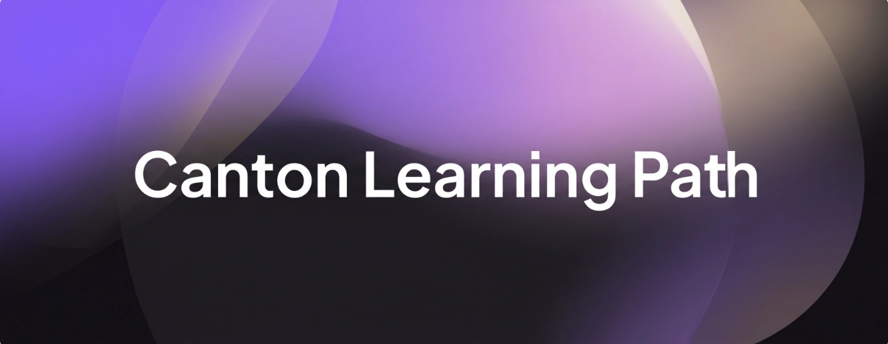

# Canton Network Learning Path

A curated, progression-ordered list of resources for developers learning to build on [Canton Network](https://canton.network).

## Foundations

### Pre-requisites

Cryptography primitives that underpin any distributed ledger.

- Public-key cryptography
  - The [Public-key cryptography](https://en.wikipedia.org/wiki/Public-key_cryptography) article covers asymmetric keys and signing. *(Est. time: 20 min)*
- Digital signatures
  - How [digital signatures](https://en.wikipedia.org/wiki/Digital_signature) authenticate transactions on any ledger. *(Est. time: 20 min)*
- Cryptographic hashing
  - [Cryptographic hash functions](https://en.wikipedia.org/wiki/Cryptographic_hash_function) covers Merkle trees and tamper evidence. *(Est. time: 25 min)*

### Blockchain Fundamentals

- The [Bitcoin whitepaper](https://bitcoin.org/bitcoin.pdf) is the original proof-of-work paper. *(Est. time: 30 min)*
- [How does Ethereum work, anyway?](https://preethikasireddy.medium.com/how-does-ethereum-work-anyway-22d1df506369) is still the best short primer on Ethereum internals. *(Est. time: 25 min)*

## Canton Network: Concepts

Architecture, privacy model, Canton Coin, and interoperability. Start here after the Foundations to understand what makes Canton different from typical L1s.

[Read the full chapter](docs/concepts.md).

## Ethereum vs. Canton

A side-by-side map for Ethereum developers: how Canton terminology and tooling relate to what you already know, plus deeper reads on where the two platforms architecturally differ.

[Read the full chapter](docs/ethereum-vs-canton.md).

## Daml

The smart-contract language, design patterns, testing workflows, and the Daml Finance library for tokenization.

[Read the full chapter](docs/daml.md).

## Building on Canton

Quickstart and LocalNet, the SDK toolbox, example apps, libraries, frontend dev with the Wallet SDK, and guidance for migrating from EVM / Solidity.

[Read the full chapter](docs/building.md).

## Platform Internals

Splice and Hyperledger Labs, the Zenith EVM on Canton, and the Canton Improvement Proposal (CIP) process.

[Read the full chapter](docs/internals.md).

## Operations and Ecosystem

Running a validator or Super Validator, block explorers and analytics, and real-world deployments by BNY, Goldman, HSBC, Nasdaq, and others.

[Read the full chapter](docs/operations.md).

## AI-Assisted Development

Working with AI coding assistants on Canton: which models handle Daml well, how to test Daml contracts with AI review, and how to improve an LLM's Daml fluency with rules, RAG, and MCP.

[Read the full chapter](docs/ai-assisted.md).

## Learning and Community

Courses and certification tracks, hackathons and grants, and the forums, blogs, and GitHub orgs where the ecosystem talks.

[Read the full chapter](docs/community.md).

## License

[MIT](./LICENSE). Upstream resources retain their original licenses and terms of use.
